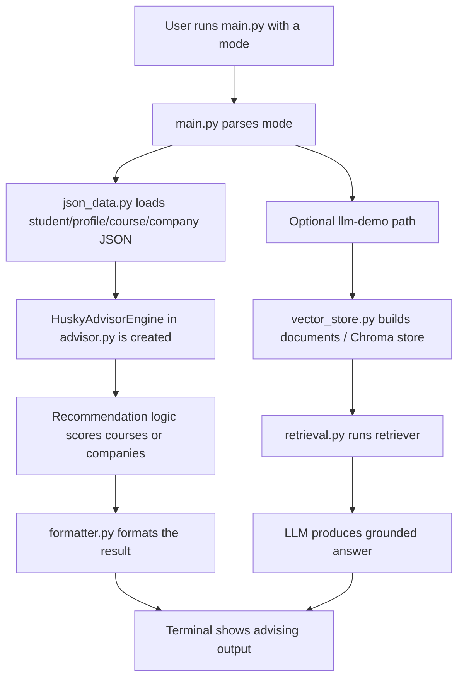

# HuskyAdvisor System Overview

## What HuskyAdvisor Is

HuskyAdvisor is an AI-assisted advising prototype for UW Bothell students. It uses a student profile, a curated course dataset, and a company/career dataset to recommend majors, electives, company-aligned paths, and internship-prep next steps.

## Where Execution Starts

The easiest entry point is:

- `src/huskyadvisor/main.py`

That file is the CLI entrypoint. When you run:

```bash
PYTHONPATH=src python3 -m huskyadvisor.main --mode profile-demo
```

Python starts in `main.py`, reads the selected mode, loads the right data files, builds a `HuskyAdvisorEngine`, and prints a formatted advising result.

## File Responsibilities

### Execution / Control

- `src/huskyadvisor/main.py`
  - starts the program
  - chooses which demo mode to run
  - loads JSON data
  - creates the advising engine

### Recommendation Logic

- `src/huskyadvisor/advisor.py`
  - scores and recommends courses
  - suggests local companies
  - creates internship-prep plans
  - builds quarter-by-quarter advice

### Data Loading

- `src/huskyadvisor/json_data.py`
  - loads student, course, company, catalog-summary, and playbook JSON files
  - normalizes course codes and prepares records for the engine

### Data Models

- `src/huskyadvisor/models.py`
  - defines the structured shapes for students, courses, companies, and results

### Output Formatting

- `src/huskyadvisor/formatter.py`
  - turns results into clean terminal output

### Optional RAG / Vector Path

- `src/huskyadvisor/vector_store.py`
  - turns records into LangChain documents and builds a Chroma vector store
- `src/huskyadvisor/retrieval.py`
  - configures the metadata-aware retriever

### Core Data Files

- `data/student_profile.json`
  - sample student information
- `data/uwb_courses_sample.json`
  - main curated course dataset
- `data/local_tech_companies.json`
  - local company alignment dataset
- `data/company_course_mapping.json`
  - explicit company-to-course recommendation map
- `data/internship_prep_playbooks.json`
  - structured prep tracks for internship-oriented guidance
- `data/uwb_recent_css_catalog_summary.json`
  - recent-offering summary derived from an external UWB catalog source

## Flow Diagram



## Practical Demo Paths

### Profile-based course advice

```bash
PYTHONPATH=src python3 -m huskyadvisor.main --mode profile-demo
```

Uses:

- `data/student_profile.json`
- `data/uwb_courses_sample.json`
- `data/local_tech_companies.json`
- `data/company_course_mapping.json`
- `data/uwb_recent_css_catalog_summary.json`

### Company alignment

```bash
PYTHONPATH=src python3 -m huskyadvisor.main --mode company-demo
```

### Internship prep

```bash
PYTHONPATH=src python3 -m huskyadvisor.main --mode internship-demo
```

## High-Level Thinking Behind The Design

The project is structured in layers:

1. data files store the school- and career-specific knowledge
2. loaders convert that data into Python structures
3. the advising engine applies scoring and recommendation logic
4. the formatter presents the result

That separation makes the project easier to debug, explain, and expand.
