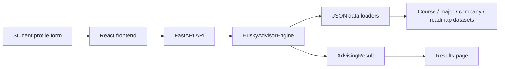

# HuskyAdvisor System Overview

## What HuskyAdvisor Is

HuskyAdvisor is a UWB-focused advising web application. It uses a student profile, structured academic data, company-pathway mappings, and recommendation logic to produce:

- major guidance
- course recommendations
- company alignment
- internship-prep suggestions
- roadmap guidance

## Main entry points

### Public website flow

The primary user-facing entry points are:

- `web/src/App.tsx`
- `api/main.py`

That is the real web-application path used by the public site and deployed API.

### Secondary CLI flow

The older local demo entry point is:

- `src/huskyadvisor/main.py`

That path still works for direct testing, but it is no longer the main product story.

## Current execution flow

### Website-backed flow

1. The user fills out the profile form in `web/src/pages/ProfileForm.tsx`.
2. `web/src/App.tsx` validates the form and sends the request through `web/src/api.ts`.
3. `api/main.py` receives the HTTP request and routes it through `api/routers/profile.py`.
4. `api/engine.py` loads the shared `HuskyAdvisorEngine` using `src/huskyadvisor/service.py`.
5. `src/huskyadvisor/json_data.py` loads the course, company, major, roadmap, and playbook datasets.
6. `src/huskyadvisor/advisor.py` scores recommendations and builds the result.
7. The API returns a structured `AdvisingResult`.
8. The React frontend renders the result cards in `web/src/pages/Recommendations.tsx`.

### Source-ingestion support flow

The project now also has a separate Crawl4AI ingestion path:

1. `scripts/crawl_with_crawl4ai.py` crawls selected public UWB and employer pages.
2. Raw markdown and crawl metadata are saved in `data/crawl4ai/raw/`.
3. `scripts/normalize_crawl4ai_exports.py` converts those exports into summaries and retrieval-ready documents.
4. Those normalized artifacts can then support manual dataset refreshes or future vector-store ingestion.

### Simple diagram

## Major folders

### `web/`

Student-facing React application.

### `api/`

Website-facing FastAPI backend intended for deployment.

### `src/huskyadvisor/`

Core recommendation logic, models, data loaders, and optional retrieval modules.

### `data/`

Structured UWB-focused datasets: courses, majors, companies, schedules, internship playbooks, and roadmap templates.

This folder now also contains `data/crawl4ai/` for raw and normalized web-source ingestion artifacts.

### `docs/`

Proposal, architecture, evaluation, deployment, and rubric-facing documentation.

## AI in the current architecture

The current deployed MVP primarily uses a structured recommendation engine. That engine still counts as meaningful AI-style logic because it uses profile-based scoring, relevance matching, suppression of already-completed courses, company intent mapping, and explainable ranking.

The repository also includes an optional retrieval-based path in:

- `src/huskyadvisor/vector_store.py`
- `src/huskyadvisor/retrieval.py`
- `src/huskyadvisor/crawl4ai_pipeline.py`

That path supports a stronger RAG-style AI story, and Crawl4AI now makes the source-gathering side of that path more realistic, but it is not the main deployed flow today.
